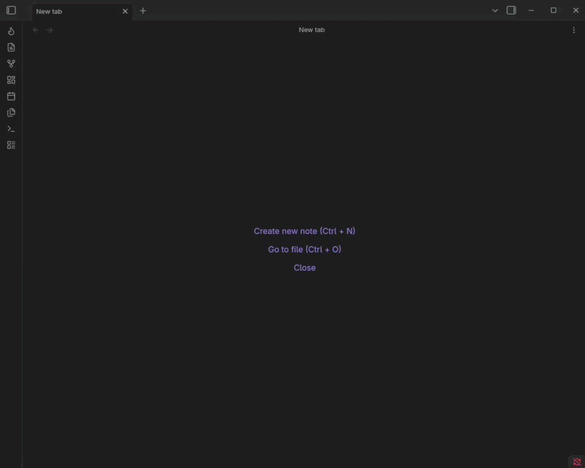

# Obsidian Habit Heatmap

A visual, gamified dashboard for tracking habits and life stats directly from your Daily Notes.



## Features
- **GitHub-Style Heatmaps**: Visual 90-day history for every stat.
- **Gamified Progression**: Earn XP, level up, and earn cosmetic titles.
- **Competitive Ranks**: Tiered ranking system (Iron to Diamond) based on performance averages.
- **Smart UI**: Automatically switches between quick-tap buttons or steppers based on your min/max boundaries.
- **Interactive Logging**: Heatmap overlay to quick-edit daily note frontmatter directly from the dashboard.
- **Avoidance Habits**: Supports tracking and rewarding habits where the goal is 0 (e.g., quitting smoking).

## Planned
- [x] Configuration menu instead of YAML
- [ ] Remove Dataview dependency
- [x] Interactive data logging from dashboard
- [ ] Unlock achievements for milestones
- [ ] Improve plugin performance 
- [x] Refactor messy classes
- [ ] Refactor messy classes again
- [ ] Submit plugin to official plugin list

## Prerequisites
- **Dataview Plugin**: Must be installed and enabled.

## Installation
1. Create a folder: `YourVault/.obsidian/plugins/habit-heatmap/`
2. Copy release files into folder and unzip (or clone repo and run `npm run dev` for live env)
3. Enable the plugin in Obsidian settings.

## Usage
Add and configure your trackers directly in the **Obsidian Settings Menu**.
Open the dashboard by clicking the **Flame icon** in the left ribbon menu. 

Alternatively, add an empty codeblock to any markdown note to embed the dashboard:
````
```habit-heatmap
```
````

### Advanced YAML Example
While the UI handles configuration, you can use the "Advanced" toggle on any tracker to manually edit its YAML:
```yaml
prop: "exercise"
title: "🏋️ Exercise"
type: "habit"
unit: "min"
goal: "up"
freq: "day"
multiplier: 1
mastery: 60
streakEnabled: true
boundaries: { min: 0, default: 0, max: 1440 }
color: { type: "relative", rgb: "255, 140, 0" }
```

### Daily Note Example 
The plugin reads from the frontmatter of your daily notes:
```markdown
---
mood: 5
exercise: 45
cannabis: 0
---
```

### Dashboard Stat Configuration Reference

Each tracker is defined by the following properties, accessible via the Settings tab.

| Property | Description |
| :--- | :--- |
| `prop` | The key used in your Daily Note frontmatter (e.g., `exercise`). |
| `title` | The display name shown at the top of the card. |
| `type` | `habit` (shows level/rank/XP) or `metric` (info-only card). |
| `unit` | The label for your data (e.g., `min`, `h`, `score`). |
| `goal` | `up` or `down`. Determines streak logic and XP rewards. |
| `freq` | `day`, `week`, or `month`. Adjusts how averages are displayed. |
| `multiplier` | XP awarded per unit. If `goal: down`, flat XP awarded for logging 0. |
| `mastery` | The daily average required to reach the "Diamond" rank. |
| `streakEnabled` | `true` or `false`. Toggles the streak tracker. |
| `boundaries` | `min`, `max`, and `default`. If max - min is 7 or less, UI uses quick-tap buttons. |
| `color` | `absolute` (uses a 3-color palette) or `relative` (uses base RGB + opacity). |

**Note on Boundaries:** The engine uses your `default` value to safely fill in gaps for days you forgot to log.